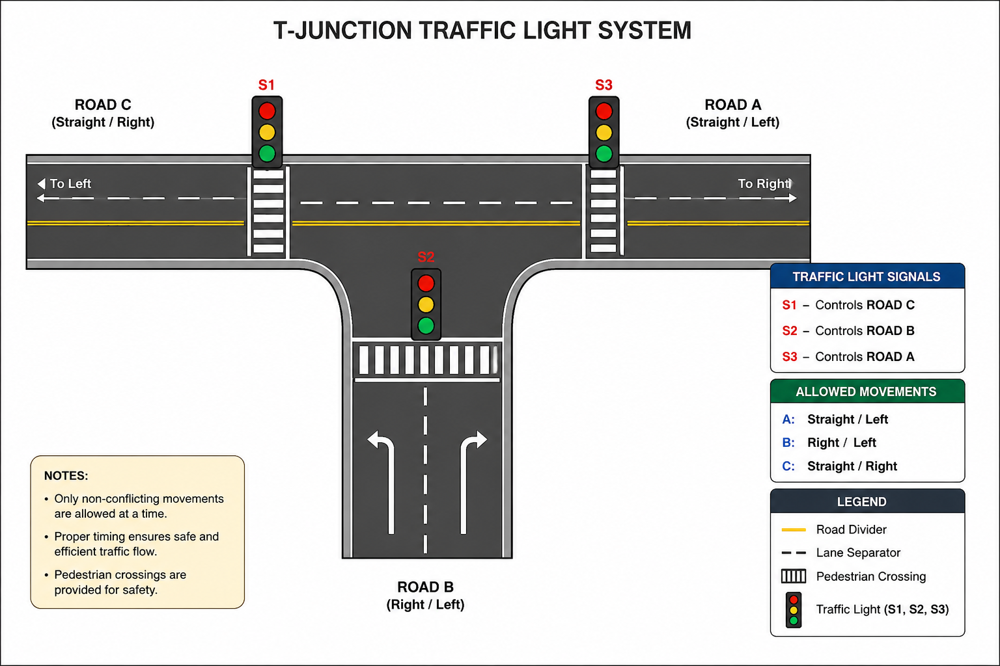
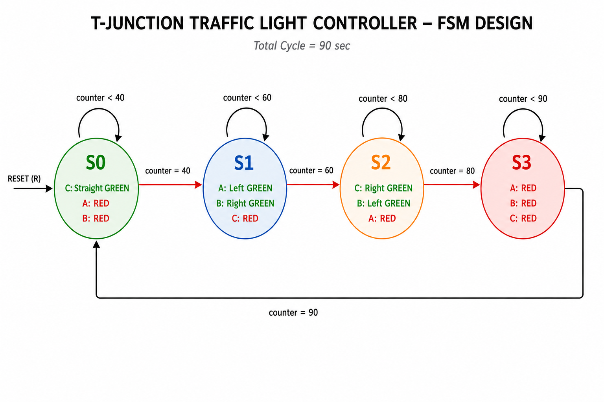

# T-Junction Traffic Light Controller

## Overview
This project models a traffic light control system for a T-junction using digital design concepts and finite state machine (FSM) based traffic sequencing.

The project aims to simulate safe and efficient traffic movement between three connected roads using traffic signal coordination.

---

## Junction Layout

---

## Junction Description

The junction consists of three signal points:

- S1 controls Road C
- S2 controls Road B
- S3 controls Road A

### Allowed Vehicle Movements

- Road A -> Straight / Left
- Road B -> Right / Left
- Road C -> Straight / Right

---

## Project Goals

- Design a safe traffic sequencing system
- Implement FSM-based control logic
- Simulate traffic signal timing
- Develop Verilog HDL implementation
- Explore real-world digital traffic control concepts

---

## Planned Features

- Traffic light state sequencing
- All-red safety delay for pedestrian crossing
- Simulation waveform analysis
- Future FPGA implementation

## Project Status

Repository setup and initial planning phase.
Fsm design

## FSM Design

The traffic controller operates using a four-state finite state machine (FSM) driven by a timing counter.

### FSM State Diagram

### State Summary

| State | Active Signals | Duration |
|-------|-----------------|----------|
| S0 | C Straight GREEN | 0–40 sec |
| S1 | A Left GREEN + B Right GREEN | 40–60 sec |
| S2 | C Right GREEN + B Left GREEN | 60–80 sec |
| S3 | All RED (Pedestrian Crossing) | 80–90 sec |

The FSM continuously cycles through these states to ensure safe and efficient traffic movement through the T-junction.

The FSM continuously cycles through these states to ensure safe and efficient traffic movement through the T-junction.